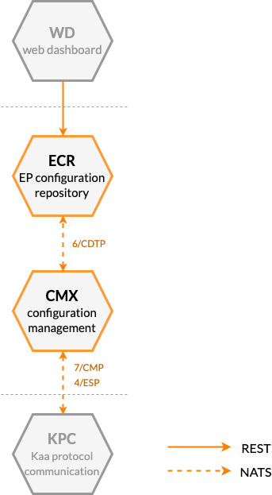




## Prerequisites

- You understand the Kaa platform [microservice-based architecture]({{root_url}}Architecture-overview/).

## Basic concept

Kaa configuration management feature helps you control the behavior of your connected devices by delivering configuration data.
This data is represented in Kaa as a free-form JSON document that can be assigned to an [application version][application] (default configuration) or to individual [endpoints][endpoint].
The default configuration applies to all endpoints registered in a given application version that do not have an individual configuration.

With the configuration management feature you can:
- Configure device behavior options: data upload frequency, edge analytics parameters, thresholds, etc.
- Deliver configuration data via push or pull.
- Store configuration updates for offline devices.

Configuration management is implemented in Kaa by a combination of several Kaa services, most importantly Configuration Management Extension service (CMX) and Endpoint Configuration Repository service (ECR).

<!-- TODO: redraw -->

[**Configuration Management Extension service (CMX)**][CMX] extends Kaa Protocol ([1/KP][1/KP]) and implements Configuration Management Protocol ([7/CMP][7/CMP]) to distribute configuration data to endpoints.
As with other Kaa extension services, CMX uses Extension Service Protocol ([4/ESP][4/ESP]) for integration with a [communication][communication] service ([KPC][KPC]).

CMX does not persist endpoint configuration data in any way---instead, configuration is pulled from an endpoint configuration data provider ([ECR][ECR]).

CMX implements a proactive configuration data push---endpoint configuration is sent to the endpoint as soon as possible, and an explicit endpoint subscription is not required.

> Note that explicit subscription is still recommended.
{:.note}

To detect when a configuration push is required, CMX listens to endpoint connectivity and lifecycle events defined in [9/ELCE][9/ELCE].

CMX acts as the *configuration data consumer* as per [6/CDTP][6/CDTP].
This protocol is used to retrieve configuration data, track endpoints' last applied configuration, and listen to endpoint configuration update events.

[**Endpoint Configuration Repository service (ECR)**][ECR] is used for storing and managing endpoint configuration data.
It exposes [REST API][ECR REST API] for the configuration management and supports integration with CMX using the Configuration Data Transport Protocol ([6/CDTP][6/CDTP]).
