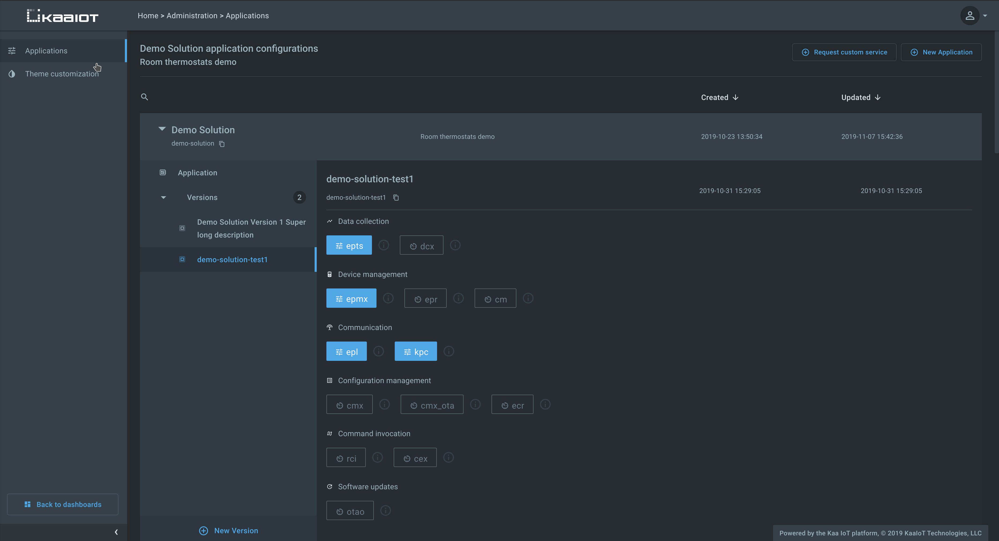
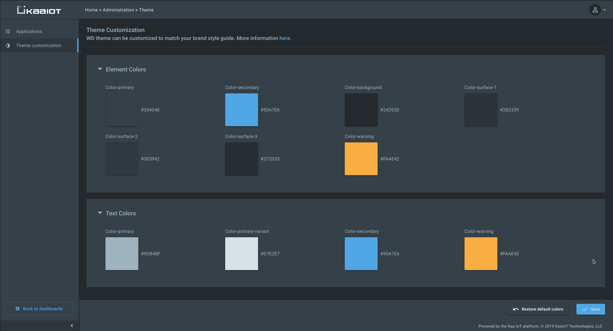




* TOC
{:toc}
​

## Future release

Below is a work-in-progress list of changes for the next Kaa platform release.

<!-- TODO: add change descriptions here -->

### Other highlights

* [**[EPTS]**][EPTS] EPTS now supports last received data points filtering by the `beforeDate` query parameter in its [REST API][EPTS time series last REST API].
* [**[EPR]**][EPR] In previous Kaa versions EPR provided endpoint metadata and endpoint filter management only via its [REST API][EPR REST API].
Now, in addition to REST API it is possible to manage endpoint [metadata][endpoint-metadata] and [endpoint filters][endpoint-filter] via [NATS][nats] using the [19/EPMMP] and [20/EFMP] protocols.
It improves overall performance and gives more flexibility in platform expansion and customization.

## Kaa 1.1-mr1 (March 25-th, 2020)
<!-- 1.1.110 -->

Kaa 1.1-mr1 is a maintenance release for Kaa 1.1.
In scope of this release the following changes were made:

* **[Bug fix]** Creating a new application or application version overwrites configuration of an existing one.
Reproducible with Java-based services when the new name is a sub-string of an existing one.
* **[Bug fix]** The [WD][WD] permits creating endpoints with an empty token.
* **[Bug fix]** The [WD][WD] does not render variables in dashboard titles.
* **[Bug fix]** Wrong [WD][WD] documentation link anchors.

## Kaa 1.1 (November 8-th, 2019)
<!-- 1.1.77 -->

Find below high-level descriptions of some of the major release highlights.

### Kaa Tekton

[Kaa Tekton][TEKTON] is a new Kaa infrastructure component that takes ownership of the Kaa [applications, application versions][application], and the application-specific configurations for [Kaa service instances][scalability].
In previous Kaa versions applications and their configurations were defined in the configuration files of each Kaa microservice.
Such configuration is still supported for backward compatibility and simple deployments.
However, Tekton now offers a more convenient management mechanism.

Tekton exposes [REST API][TEKTON REST API] for managing applications, versions, and the associated configurations.
The [Web Dashboard (WD)][WD] leverages this API and provides a convenient management UI.
Applications are represented as [protected resources][application resource type] in the auth server, so you can configure users' level of access by granting corresponding [OAuth 2.0 scopes][oauth scope].

Whenever the list of applications, versions, or service configs changes, Tekton generates an appropriate [17/SCMP][17/SCMP] notification message over NATS that gets delivered to all affected service replicas.
In turn, they reload updated configurations from Tekton and apply changes immediately without a restart.
It is no longer necessary to update all service instance configuration files or reboot service replicas.

You can use [this script](https://github.com/kaaproject/kaa/blob/master/doc/Whats-new/attach/v1.1/generate_tekton_config.py) to convert your Kaa 1.0 blueprint configuration files into a JSON suitable for [Tekton bulk configuration load REST API][TEKTON bulk config load REST API].
Note that due to the various compatibility reasons the application and application version names must be limited to lowercase latin letters (`a-z`), digits (`0-9`), dashes (`-`) and underscores (`_`).

### Unified resource naming convention

The Kaa platform uses [OAuth 2.0][oauth2] and [User-Managed Access (UMA)][uma] for API calls authentication and authorization.
Starting with Kaa 1.1 all Kaa components follow a [unified resource naming convention][api security] that is designed to prevent naming conflicts.
Users upgrading from Kaa 1.0 must rename resources in their auth servers according to the new convention.

### Web Dashboard theme customization

Previously, the Web Dashboard theme customization was possible via loading custom CSS.
In Kaa 1.1 the primary UI colors were revised and consolidated, and the theme customization is now possible right from the Administration page.

### Other highlights

* [**[CEX]**][CEX] CEX now supports synchronous and asynchronous [REST API][CEX REST API] calls for command invocation.
  Due to this, the [RCI][RCI] microservice is now deprecated and will be retired in a future Kaa version.
* [**[CEX]**][CEX] In previous Kaa versions CEX would send new commands asynchronously to any connected endpoint.
  Starting with Kaa 1.1, according to [11/CEP][11/CEP] protocol, CEX no longer would send new commands asynchronously after the endpoint sends a command request message with `observe` flag explicitly set to `false`.
* [**[CMX]**][CMX] In previous Kaa versions CMX would send new configurations asynchronously to any connected endpoint.
  Starting with Kaa 1.1, according to [7/CMP][7/CMP] protocol, CMX no longer would send new configurations asynchronously after the endpoint sends a configuration request message with `observe` flag explicitly set to `false`.
* [**[EPTS]**][EPTS] [Auto-extracted time series][EPTS time series auto extraction] now have `auto~` prefix to prevent name conflicts with user configured time series.
* [**[EPTS]**][EPTS] Support for saving time series data via the [EPTS REST API][EPTS time series PUT REST API].
* [**[EPTS]**][EPTS] Support for storing and retrieving [time series data with explicit `null` values][EPTS time series extraction].
* [**[EPTS]**][EPTS] User configured time series names are now limited to a combination of lowercase latin letters (`a-z`), digits (`0-9`), dashes (`-`) and underscores (`_`).
* [**[CM]**][CM] REST API [OAuth 2.0 scopes][oauth scope] for [client credential and certificate management][CM clients REST API] changed to `kaa:client-credentials:read`, `kaa:client-credentials:create`, `kaa:client-credentials:update`, `kaa:client-certificates:read`, `kaa:client-certificates:create`, and `kaa:client-certificates:update`.
* [**[CM]**][CM] CM now only accepts x.509 cert serial number in base 10 encoding on provisioning and validation.
  Also, a specific list of x.509 cert issuer fields processed by CM is restricted and documented [here][CM certificate POST REST API].
  Active x.509 client certificates must be re-provisioned into CM.
* [**[EPR]**][EPR] EPR no longer supports `GET /applications` and `GET /applications/{applicationName}` REST API calls.
  The API for retreving application information is now [available from Tekton][TEKTON applications REST API].
* [**[EPR]**][EPR] EPR now supports creating endpoints with [user-defined endpoint IDs][EPR endpoint POST REST API].
  Such IDs must match `^[a-zA-Z0-9._~-]+$` regex pattern.
  This is useful for matching entities between Kaa and external systems.
* [**[KPC]**][KPC] KPC now always observes the MQTT keepalive interval set by the client in the CONNECT packet.
* [**[KPC]**][KPC] Support for [endpoint][endpoint] roaming across [client][client] MQTT connections to different KPC replicas.
  When multiple gateways (Kaa clients) represent a single endpoint, they may communicate on behalf of such endpoint in turns.
  Whenever such communication switch (roaming) occurs, even across KPC replicas, they are now able to identify that and correctly remove endpoint from the routing table of the previously used KPC replica.
* [**[WD]**][WD] Default "Device management" and "Software management" pages are now available in WD to administrators with `application:update` OAuth 2.0 scope granted for a given Kaa application.
* [**[WD]**][WD] Added the ability to specify the default sort key and direction in endpoint list and time series table widgets.
* Documentation restructuring: previously Kaa components documentation was hosted separately from the general documentation.
  For the readers' convenience, all component docs are now relocated to the ["Features and components" section][kaa features].
  This documentation now captures the exact state of all platform components at the moment of the general platform release.
  You can refer to the "Components" subsection of each feature page to find out the specific service versions included in a given release.
  For example, see the ["Device management" feature page](../Features/Device-management/#components).
* Multiple performance optimizations, usability and visual improvements, and bug fixes.

## Kaa 1.0 (June 10-th, 2019)

Kaa 1.0 is the initial general release of the Kaa Enterprise IoT platform.

Prior to the 1.0 version, every Kaa component was versioned independently.
Such independent versioning still exists for each of the Kaa microservices, while the Kaa 1.0 release is a "meta-package" that includes a set of component versions.
All of the microservices in Kaa 1.0 have been tested for interoperation and can be installed in one shot to a Kubernetes cluster of your choice with a new Kaa installer.
